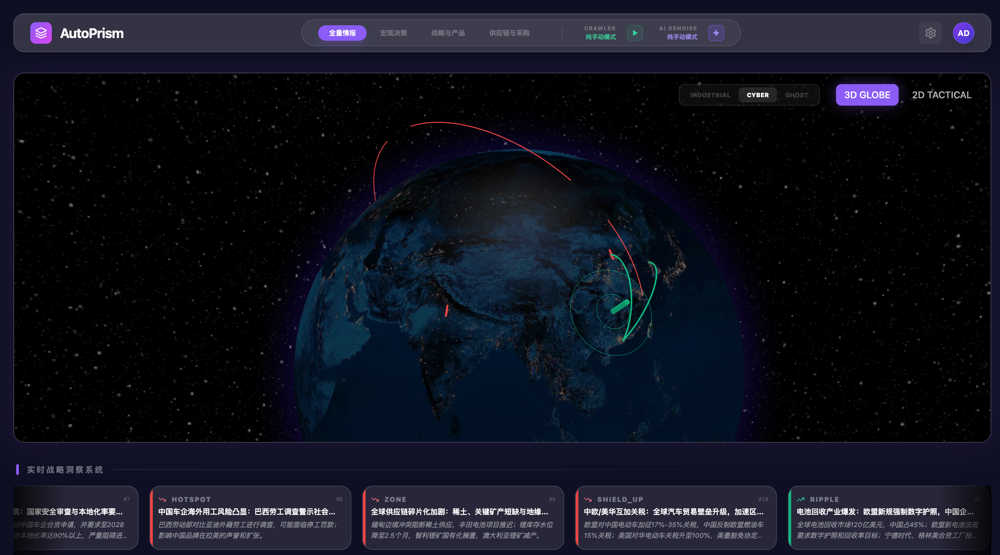

# AutoPrism 🌍


AutoPrism V1 是一款面向汽车产业与投资研究的**本地数据快照与全局情报看板**。`main` 分支是无需登录的单机版本；V2 与 SaaS 在独立分支持续演进。

<div align="center">
  
  <br>
  <em>AutoPrism 全局指挥中心概览</em>
</div>
<br>
<div align="center">
  
  <br>
  <em>AutoPrism 结构化数据大盘与 AI 洞察流</em>
</div>
<br>

系统重点是把数据库中的 L1 原始快照转换为 INFO 结构化记录和 L2 战略洞察，并保留 INFO 到原始快照的证据关系。没有可验证数据时，界面显示空状态，不生成随机曲线或行业基准值。

---

## ✨ 核心特性 (Core Features)

- **🌍 双地图态势感知引擎 (Dual Map Engine)**
  - **宏观战略视角 (Globe View)**：基于 `globe.gl` 渲染的 3D 旋转地球，直观展示全球供应链断裂、地缘危机冲击节点。
  - **微观战术视角 (Tactical View)**：基于 `deck.gl` 的高性能 2D 散点图，轻松承载百万级别的终端销量数据和经销网络。
- **🧠 AI 结构化管线 (AI Denoising Pipeline)**
  - 通过 OpenAI 兼容接口处理数据库中已有的 L1 快照。
  - 模型只负责生成候选结构；缺失或越界的核心数值会被代码拒绝，不会使用默认值补齐。
- **🔗 数据证据链 (Evidence Chain)**
  - INFO 记录可回溯到一个或多个 L1 快照。
  - L1 内容采用哈希去重和不可变修订；错误值以新修订替代，不覆盖历史。
- **📊 动态车型对标库 (Dynamic Benchmarking)**
  - 采用 PostgreSQL `JSONB` 结构灵活存储行业内日新月异的技术指标（如端到端智驾算力、电池形态），告别死板的列式数据库。

---

## 🛠 技术栈 (Tech Stack)

### 前端 (Frontend)
* **框架**: React 18 + Vite + TypeScript
* **样式**: Tailwind CSS (定制化 `autoprism` 深色指挥中心主题)
* **渲染引擎**: `globe.gl` (Three.js), `deck.gl` (WebGL), `ECharts`
* **状态管理**: `Zustand`
* **交互**: `Framer Motion`, `@dnd-kit/core`

### 后端 (Backend)
* **框架**: Python 3.11+ + FastAPI
* **数据库**: PostgreSQL 16 + `asyncpg` (SQLAlchemy 2.0 ORM)
* **智能调度**: `httpx` (异步大模型 API 调用) + 后台轮询任务队列

---

## 🚀 快速开始 (Getting Started)

### 1. 配置云端 AI API（可选）

浏览已有数据库和启动界面不需要 API 密钥。只有主动执行 AI 候选发现、INFO 结构化或 L2 洞察生成时才需要配置。密钥只放在本地 `backend/.env`，不要提交到 Git：
```bash
# 复制示例配置文件
cd backend
cp .env.example .env

# 在 .env 中填入您的模型配置
AI_API_BASE="https://api.openai.com/v1"  # 或使用百炼/Moonshot等其他兼容平台
AI_API_KEY="sk-xxxxxxxxxxxxxxxxxxx"      # 您的 API 密钥
AI_MODEL="gpt-4o"                        # 推荐使用 GPT-4o 或顶级国产大模型
```

### 2. Docker Compose 一键启动

确保 Docker Desktop 已启动，在项目根目录运行：

```bash
docker compose up -d --build
```

- 前端：[http://localhost:5173](http://localhost:5173)
- API 文档：[http://localhost:8000/docs](http://localhost:8000/docs)
- 就绪检查：[http://localhost:8000/ready](http://localhost:8000/ready)

容器启动时会自动执行 Alembic 数据库迁移。

### 3. 本地开发

```bash
# 后端
cd backend
pip install -r requirements.txt -r requirements-dev.txt
alembic upgrade head
uvicorn app.main:app --host 0.0.0.0 --port 8000 --reload

# 前端（另一个终端）
cd frontend
npm ci
npm run dev
```

### 4. 自动化测试

```bash
cd backend
pytest -q

cd ../frontend
npm run lint
npm run build
npm audit
```

`backend/test_ai_pipeline.py` 是可选的真实模型调用脚本，不属于离线测试套件，运行它可能产生模型费用。

## 数据可信度说明

- 当前 V1 的 AI “搜索”是遗留的候选发现机制，并不等同于真实浏览器爬虫或官方 API 采集。
- 所有治理前的原始记录统一标为 `legacy_unverified`，保留可浏览性但不声称已验证。
- 新快照保存 `content_hash`、抓取时间、修订号和替代关系；相同内容不会重复写入。
- INFO 记录通过证据关联表指向全部参与结构化的 L1 快照。
- 真实 HTML、动态网页、PDF、RSS、CSV/Excel、官方 API 和合规登录采集属于 V2 路线，详见 [V1 重构说明](docs/V1_REFACTOR.md)。

---

## 📂 目录结构 (Project Structure)
```text
AutoPrism/
├── Architecture.md         # 系统整体技术架构设计方案
├── PRD.md                  # 产品需求文档
├── README.md               # 本文件
├── frontend/               # React + Vite 前端代码库
│   ├── src/components/maps # 核心地图渲染组件 (GlobeMap, DeckGLMap)
│   └── tailwind.config.js  # 指挥中心样式配置
└── backend/                # Python + FastAPI 后端代码库
    ├── alembic/            # 数据库迁移与 legacy 证据回填
    ├── app/models/sql.py   # L1 -> INFO -> L2 数据模型
    ├── app/services/ai_service.py # AI 降噪清洗引擎管线
    ├── tests/              # 离线自动化测试
    └── test_ai_pipeline.py # 可选的真实模型调用脚本
```

---

## ☕️ 赞赏与支持 (Support)

如果这个项目对你有帮助，欢迎通过微信赞赏码请我喝杯咖啡！你的支持是我持续开源和更新的动力。


---
*AutoPrism - Turning Chaos Into Clarity.*
